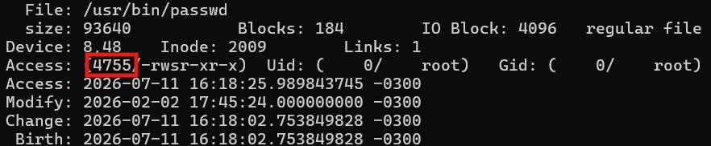
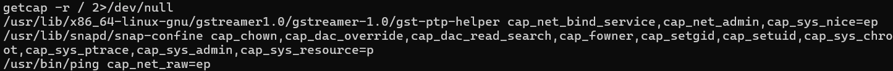
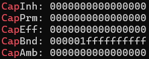
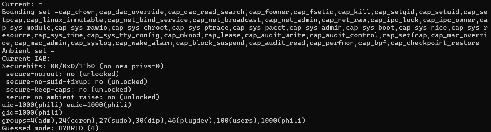

# Escalonamento de Privilégio
Este documento traz noções sobre a obtenção de acessos verticais e horizontais em um sistema. Os tópicos abordados serão SUID (Set Owner User ID), Linux Capabilities, Docker Breakout e processos invisíveis.

Como dito no README, tudo o que está escrito reflete o meu entendimento pessoal sobre o conteúdo, podendo conter equívocos e não sendo necessariamente formal.

## 1. SUID (Set User ID)
O SUID é uma permissão especial atribuída ao arquivo. O valor indicativo de sua utilização faz parte do `inode` (Index node), que é uma estrutura de dados em Unix e Linux na qual se armazenam os metadados de um arquivo (tamanho, **permissões**, dono, etc). 

O SUID faz parte de uma estrutura de 3-bits, onde cada um representa, respectivamente, [SUID, SGID, Sticky Bit]. Um arquivo irá possuir ao menos um dos seguintes casos demonstrados na **Tabela 1** ou o somatório deles:

**Tabela 1 - Bits representativos de permissões especiais**
| Permissão atribuída | Bit ativo |
| :--- | :---: |
| SUID ativo | [1,0,0] |
| SGID ativo | [0,1,0] |
| Sticky ativo | [0,0,1] |
| Nenhum ativo | [0,0,0] |

Além disso, esse conjunto de 3-bits fará parte de uma estrutura maior de 4 números de base octal: Permissão Especial, Dono, Grupo e Outros. Para cada coluna, pode haver um valor de 0 a 7 que representa um bloco de 3-bits, o qual, da esquerda para a direita, representa respectivamente [Leitura, Escrita, Execução].

A fim de melhorar a compreensão da identificação dessas estruturas descritas acima, vou apresentar um exemplo utilizando o comando abaixo e seu output demonstrado na **Figura 1**:

`stat /usr/bin/passwd`

**Figura 1 - Output do comando stat**


O valor destacado na **Figura 1** por um retângulo vermelho é como o computador visualiza as permissões do arquivo no nível de máquina, e logo à direita é como ele é formatado para leitura humana (`-rwsr-xr-x`). Nesse sentido, vamos utilizar o valor base **4755**.

Em seguida, apresento na **Tabela 2** a decomposição lógica desse valor:

**Tabela 2 - Decomposição Octal (4755)**
| Permissões Especiais | Dono | Grupo | Outros |
| :---: | :---: | :---: | :---: |
| 4 | 7 | 5 | 5 |

* **Permissões Especiais (4):** Pode ser representado na base 2 por [1,0,0]. Voltando na **Tabela 1**, descobrimos que esse arquivo só possui o SUID ativo.
* **Dono (7):** O valor dessa coluna representa as permissões que o usuário-dono (proprietário único) possui. Assim como nas permissões especiais, esse número é a representação octal dos bits [1,1,1]. A partir do que foi explicado acima, o dono pode Ler, Escrever e Executar esse arquivo.
* **Grupo (5):** Conjunto de usuários atrelados ao arquivo. Seguindo a mesma lógica, em bits será [1,0,1]. Logo, o grupo pode Ler e Executar, mas não escrever.
* **Outros (5):** Qualquer outro usuário logado no sistema. Por fim, tendo o mesmo valor do anterior, também terá permissões exclusivas de Leitura e Execução do arquivo.

Em suma, verificamos que esse arquivo possui a permissão de SUID ativada (o programa rodará com os mesmos poderes do seu Dono). O Dono possui poder de Leitura, Escrita e Execução, enquanto o Grupo e os Outros possuem apenas Leitura e Execução.

## 1.2. Aplicação na Identificação de Vulnerabilidades

A busca por vulnerabilidades se baseia em mapear como essas permissões interagem. Existem dois vetores principais de ataque explorando o SUID:

1. **Permissão de Escrita Indevida:** A ideia é achar arquivos que possuam SUID ativo e, simultaneamente, permissão de **escrita** para classes além do Dono. Por exemplo, no cenário mais crítico, se a classe `Outros` tiver permissão de escrita, qualquer usuário do sistema poderá apagar o conteúdo do arquivo legítimo, injetar um script malicioso no lugar e executá-lo (rodando como *root*).
2. **Abuso de Funcionalidade (O mais comum):** Ocorre quando um arquivo tem o SUID ativo, mas é rígido quanto à escrita (apenas o root escreve). A vulnerabilidade surge se esse programa for um utilitário **interativo** (como `python`, `vim`, `bash`, `nmap` ou `find`). O atacante utiliza o comando legítimo do programa para abrir um terminal ou ler um arquivo restrito, abusando do fato de que o processo está temporariamente utilizando o crachá do administrador.

___

## 2. Linux Capabilities

Para resolver o problema inerente ao SUID — onde um arquivo ganha status absoluto de *root* para executar uma tarefa restrita —, o poder do administrador é fragmentado. Essa abordagem concede ao arquivo somente a permissão exata (a *capability*) necessária para realizar uma atividade específica, não sendo mais preciso dar o controle total da máquina a um processo.

Para verificarmos quais *capabilities* estão atribuídas aos arquivos do sistema, podemos utilizar o comando `getcap -r / 2>/dev/null`. Decompondo o comando, temos:
* `getcap`: Ferramenta que busca e lê as *capabilities* (gravadas nos atributos estendidos).
* `-r`: Busca recursiva. Faz com que o comando entre em todas as pastas e subpastas a partir da raiz (`/`).
* `2>`: Redirecionamento da Saída de Erro (*Standard Error*). O descritor `2` captura os avisos de "Acesso Negado" gerados ao tentar ler pastas proibidas.
* `/dev/null`: O "buraco negro" do Linux. O local de descarte para onde os erros capturados pelo `2>` são enviados, mantendo a tela limpa apenas com os resultados positivos.

Ao executar o comando, o *output* seguirá a seguinte estrutura: 
`[Caminho do Arquivo] [Nome da Capability] = [Sinalizadores]`

* **Caminho do arquivo:** Onde o programa está fisicamente no disco.
* **Nome da Capability:** Qual fragmento do poder de *root* foi concedido ao arquivo (se houver mais de um, aparecerão em sequência, separados por vírgula).
* **Sinalizadores (Flags / Sets):** São as letras logo após o símbolo `=`.

A seguir, na **Figura 2**, o output do comando `getcap`:

**Figura 2 - Output getcap**


### Valores dos Sinalizadores
As *flags* definem como a *capability* vai operar. Cada arquivo com *capabilities* possuirá ao menos um destes *sets*:

* `p` (Permitted - Permitida): O arquivo tem a permissão para usar aquele fragmento de poder, mas ele não está necessariamente ativo. É necessária uma instrução interna no código do programa para ativá-lo no momento do uso.
* `e` (Effective - Efetiva): A *capability* já está ativada e pronta para uso desde o início da execução do processo.
* `i` (Inheritable - Herdável): Se este programa criar ou executar outro programa (um processo filho), o filho herdará essa mesma *capability*.

### Capabilities Críticas na Cibersegurança (Vetores de Ataque)

Embora o Linux possua quase 40 *capabilities* diferentes, a grande maioria delas permite apenas ações de baixo impacto (como alterar o relógio do sistema ou emitir um *ping*). No entanto, para um atacante focado em **Escalonamento de Privilégio**, existem as "Red Flags". 

Se você encontrar um binário interativo (como `python`, `gdb`, `tar`, `vim`) com alguma das *capabilities* abaixo ativada, o sistema tem uma vulnerabilidade crítica.

#### 1. A Tríade da Identidade e Arquivos
Estas são as chaves mais clássicas e fáceis de explorar, pois lidam diretamente com quem você é e o que você pode acessar.
* **`CAP_SETUID` e `CAP_SETGID`**: 
  * **O Perigo:** Permitem que o processo mude livremente o seu UID (User ID) para 0 (root). 
  * **Ataque:** Se o `python` tiver essa permissão, o atacante roda `python -c 'import os; os.setuid(0); os.system("/bin/sh")'` e ganha um terminal *root* instantâneo.
* **`CAP_DAC_OVERRIDE` e `CAP_DAC_READ_SEARCH`**: 
  * **O Perigo:** "DAC" significa o controle de permissões padrão (rwx). Essas chaves simplesmente desligam a checagem de permissão do disco para aquele processo.
  * **Ataque:** Você pode usar o programa para ler arquivos críticos, como o `/etc/shadow` (onde ficam os *hashes* das senhas), ou sobrescrever o `/etc/passwd` para criar um novo usuário *root*, mesmo não sendo o dono de nenhum desses arquivos.

#### 2. Manipulação de Processos e Kernel
Estas chaves são extremamente perigosas porque operam em um nível de memória muito baixo, permitindo dominar processos de outros usuários.
* **`CAP_SYS_PTRACE`**: 
  * **O Perigo:** Usada originalmente por depuradores (como o `gdb`), permite anexar a execução de um programa a outro processo que já está rodando e inspecionar/modificar sua memória.
  * **Ataque:** Um invasor pode usar essa *capability* para injetar um *shellcode* malicioso (código de máquina) dentro de um processo que já está rodando como *root* no servidor.
* **`CAP_SYS_MODULE`**: 
  * **O Perigo:** Permite carregar e descarregar módulos do próprio Kernel do Linux.
  * **Ataque:** O atacante compila um *Rootkit* (um malware que se esconde no nível do Kernel) e usa essa *capability* para instalá-lo profundamente no sistema operativo, tornando a infecção praticamente indetectável pelas ferramentas convencionais.

#### 3. A Chave Curinga
* **`CAP_SYS_ADMIN`**: 
  * **O Perigo:** É conhecida na comunidade de segurança como o "novo root". Como os desenvolvedores do Linux ao longo dos anos tinham preguiça de criar novas *capabilities* para cada nova funcionalidade do Kernel, eles começaram a jogar tudo dentro da `CAP_SYS_ADMIN`.
  * **Ataque:** Ela tem dezenas de poderes implícitos. O mais perigoso no contexto de escalonamento é a capacidade de montar e desmontar sistemas de arquivos. Um atacante pode montar um disco falso, acessar recursos isolados ou modificar o comportamento base do sistema operativo.

#### 4. O Vetor de Rede (Lateralidade)
* **`CAP_NET_RAW` e `CAP_NET_ADMIN`**:
  * **O Perigo:** Controle sobre os pacotes de dados.
  * **Ataque:** Embora nem sempre forneça um terminal *root* direto, permite que o atacante coloque a placa de rede em modo promíscuo (*sniffing*), capturando tráfego, senhas não criptografadas e *tokens* da rede interna da empresa, abrindo caminho para o movimento lateral para outras máquinas mais importantes.

### Coexistência e Vulnerabilidades (SUID vs. Capabilities)
Pode-se entender que as *capabilities* são mais seguras que a atribuição de SUID, visto que aplicam o princípio do privilégio mínimo (dando apenas o necessário). 

Teoricamente, seria ideal substituir todo o uso de SUID por *capabilities*. Na prática, essa substituição demandaria a refatoração de grande parte do ecossistema legado do Unix/Linux. Por isso, **ambos os sistemas são utilizados simultaneamente**. 

Isso abre uma grande margem de vulnerabilidade, pois são sistemas de permissão independentes. Um arquivo vulnerável pode possuir SUID (sem *capabilities* críticas) ou possuir uma *capability* crítica (sem SUID), e apenas um deles configurado de forma incorreta é suficiente para o atacante escalar privilégios.

Um caso de estudo interessante ocorre quando o atacante encontra um arquivo com SUID, executa um *exploit* , e mesmo assim a escalada de privilégio falha. Isso geralmente ocorre porque o ambiente/SO está conteinerizado (operando com um filtro de bloqueio). Vamos trabalhar esse cenário logo adiante no tópico de **Docker Breakout**.

## 3. Docker Breakout
Primieiramente vamos entender a diferença entre `Máquina Virtual` (VM) e `Docker`. A VM é a virtualização do hardware, já o Docker é virtualização a nível de SO, o kernel e compartilhado. O contâiner é criado a partir de três coisas:

* **Namespace**: é os limites desse container. Aqui será definido:
    * **PID (Process ID):** Isola a árvore de processos. O contêiner ganha seu próprio conjunto de IDs de processo, de modo que o processo com PID 1 dentro do contêiner seja diferente daquele no host.
    
    * **NET (Network):** Fornece uma pilha de rede isolada. Isso permite que o contêiner tenha suas próprias interfaces de rede (como eth0), portas e endereços IP, sem conflito com o host ou outros contêineres.
    
    * **MNT (Mount):** Isola os pontos de montagem e o sistema de arquivos. Cada contêiner vê apenas a sua própria estrutura de diretórios.
    
    * **UTS:** Permite que o contêiner possua seu próprio hostname e domínio, independentes do sistema operacional hospedeiro.

    * **IPC (Inter-Process Communication):** Isola os recursos de comunicação entre processos, como filas de mensagens e memória compartilhada, evitando que os dados se misturem.
    
    * **USER:** Isola o mapeamento de usuários e grupos. Permite que um processo rode como root dentro do contêiner, mas tenha privilégios de um usuário comum no host, garantindo maior segurança.

* **Cgroups**: Isolam o que o processo pode gastar (limite de RAM e CPU)

* **Filtro de capabilities**: O Docker retira a maiora dos capabilities que vimos no tópico anterior

Em suma, é comum ao invadir um container o invasor se torne o dono do "quarto" e não da máquina em si. Contudo para isso, temos que achar uma brecha com acesso à maquina de fato.

### Técinas de fuga do container

#### 1. Escalonamento de privilégio através de má-configuração

Nesta primeira técnica, buscaremos contêineres com execução privilegiada (`--privileged`), o que devolve as *capabilities* para o ambiente. O ataque consiste em listar e montar os discos físicos do servidor diretamente dentro do contêiner. Podem-se utilizar os seguintes comandos:

```bash
# 1. Verifica se você consegue ver os discos físicos da máquina host (ex: /dev/sda1 ou /dev/vda1)
fdisk -l

# 2. Cria uma pasta temporária dentro do seu contêiner
mkdir /mnt/servidor_real

# 3. Monta o disco físico real do Host nessa pasta temporária
mount /dev/sda1 /mnt/servidor_real

# 4. Muda o diretório raiz do seu terminal para a pasta montada
chroot /mnt/servidor_real bash
```

Mas afinal, como sabemos se estamos em um contêiner privilegiado? Se os comandos acima tiveram sucesso, a resposta é sim. O ambiente será identificado como privilegiado justamente se as ferramentas que acessam o hardware do servidor puderem ser executadas sem erros de permissão. 

Como a ferramenta `getcap` não funciona neste cenário (pois ela lê os atributos de arquivos no disco, e o privilégio do Docker é injetado diretamente na memória do processo), utilizamos outras técnicas de enumeração de ambiente:

1. **O Teste Visual (`ls /dev`):** Em um contêiner restrito, a pasta `/dev` (onde ficam os arquivos de bloco de hardware) é quase vazia. Em um contêiner privilegiado, o Docker permite que você veja todos os dispositivos físicos do servidor. Se ao listar a pasta você visualizar discos como `sda1`, `vda1` ou `nvme0n1`, o contêiner possui privilégios.

2. **Leitura direta do status do processo no Kernel:** Podemos extrair informações detalhadas sobre as permissões do processo que roda o nosso terminal dentro do contêiner utilizando o comando:
```bash
    # cat: comando para exibir o texto de um arquivo no terminal
    # /proc/ (process): pseudo-sistema de arquivos virtuais em RAM com dados dos processos
    # /self/: atalho que entra automaticamente no diretório do PID do processo atual
    # grep: comando de filtragem, no caso, exibe apenas as linhas que contêm "Cap"
    
    cat /proc/self/status | grep Cap
```
A **Figura 3** mostra a saída do comando acima. As linhas representam:
* **CapPrm (Permitted - Permitida):** `0000000000000000`
* **CapEff (Effective - Efetiva):** `0000000000000000`
* **CapInh (Inheritable - Herdável):** `0000000000000000`
* **CapAmb (Ambient - Ambiente):** `0000000000000000`

**Figura 3 - Output do cat /proc/self/status**


Essas quatro primeiras linhas estão zeradas porque o comando foi executado como um usuário comum, sem poderes ativados no momento.

Agora, a linha mais importante para a enumeração é a **`CapBnd` (Bounding Set - Conjunto Limite)**. Ela exibe o limite máximo de *capabilities* que este ambiente permite acessar. Atualmente, o Linux mapeia 41 *capabilities*. Fazendo a conversão, os dez caracteres `f` hexadecimais representam 40 *capabilities* (4 bits cada), e o número `1` representa a 41ª. Os cinco `0`s (zeros) sobrando à esquerda são apenas espaços reservados na arquitetura de 64 bits para futuras *capabilities* que vierem a ser adicionadas ao Kernel. Se essa linha estiver preenchida com essa máscara máxima (`000001ffffffffff`), significa que o Docker não impôs filtros de segurança.

3. **Tradução das Capabilities do Processo:**
O comando anterior nos mostra o conjunto em formato hexadecimal cru. Para listar e ler os nomes literais das *capabilities* anexadas ao processo de forma humana, utilizamos a ferramenta *Capability Shell*:
```bash
capsh --print
```

A **Figura 4** abaixo ilustra a saída deste comando, evidenciando as chaves que temos à disposição:

**Figura 4 - Output do capsh --print**


> **Nota de Estudo:** Criarei um documento separado (`.md`) no diretório `/architecture/` referente à estrutura base de diretórios do Unix/Linux. Nele, irei aprofundar os estudos sobre o pseudo-sistema de arquivos `/proc` e outros diretórios fundamentais do sistema operacional.